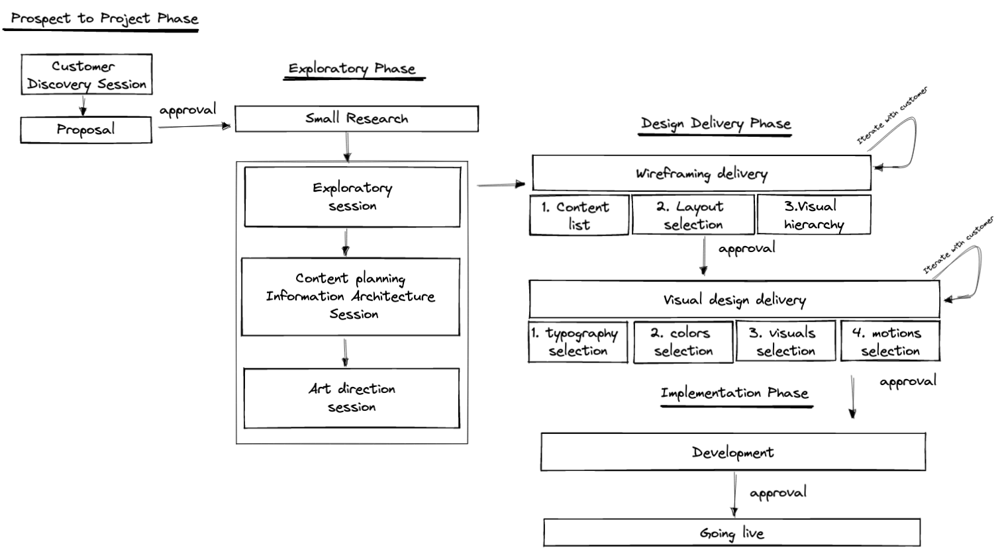

# Website Design Process 

## Table of contents
1. [Customer discovery session](#customer-discovery-session)   
2. [Proposal](#proposal)    
3. [Small Research](#small-research)   
4. [Exploratory session](#exploratory-session)    
5. [Content planning and information architecture session](#content-archi-session)    
6. [Art direction session](#art-direction)   
7. [Wireframe delivery](#wireframe-delivery)  
8. [Visual design delivery](#visual-design-delivery)    
9. [Development](development)   
10. [Going live](going_live)     
 

## Customer discovery session
Conduct a session gathering enough information to be able to scope and send a proposal. Furthermore already estimate if we have interest, skills and enough time to take the project. 

[ ] Have you clearly defined the problem you’re trying to solve?    
[ ] How is the problem having a negative impact on the business ?    
[ ] What is the exact scope ?    
[ ] When should the project be delivered ?    
[ ] Who is the target audience ?    
[ ] How many stakeholders are there ?    
[ ] What is a rough estimation of the budget ?    
   
## Proposal 
Send a proposal and negotiate to win the project.    

[ ] Does the proposal contains the terms and conditions ?    
[ ] Did you take a correct price margin (non disclosed revisions) ?    
[ ] Does the propoosal describe the process and milesones for delivery ?   
[ ] Does the proposal a concrete delivery agenda ?    

## Small research 
Make a small research about the customer and his problem. Already prepare the exploratory session by gathering competions websites, mood board et...

[ ] What is the company core business ?   
[ ] What is the size of the company ?   
[ ] Who is the audience ?    
[ ] Do they have a website ? If yes how do they tackle the problem ?   
[ ] Do they have competiton ? If yes what is their websites ?   
[ ] How does the competition tackled the problem ?    
[ ] How does the competition designed their website (colors, typo...) ?    
[ ] Do they already have brand guide ?      
[ ] Did you made a list of the overall potential content that you think should be on the website ?       
[ ] Did you create a potential possible sitemap ?     
[ ] Did you find a list of websites with different possible potential layouts ?    
[ ] Did you create a mood board for the color palette ?   
[ ] Did you create a mood board for the typography ?    
[ ] Did you create a mood board for the imagery ?     

## Exploratory session 
Conduct a session with the customer were we need present were we are today, where we are heading and how we will do it. The purpose of this session is mainly align everyone on what is actual problem (root cause analysis) what would be the preferred solution. 

[ ] How do they describe their business ?    
[ ] What is the main problem we are trying to solve ?    
[ ] Is everyone in the team aligned on the problem which needs to be fixed ?   
[ ] How does the problem impact negatively your business ?   
[ ] What happens if we don't solve the problem ?   
[ ] What is the target audience ? (culture, gender, location, social...) ?    
[ ] What language should the website be in ?   
[ ] What devices will be the most used to access the website ?    
[ ] What does the competition look like ?    
[ ] How did tackle the same problem ?    
[ ] How are we going measure success ?     
[ ] Any special features that we should know of ?      
[ ] Any brand guidelines ?    
[ ] Legal copy reviewing ?    
[ ] When the website should be delivered ?    
[ ] Who will update your website ?    
[ ] How often will the website be updated ?   

## Content planning and information architecture session               
Conduct a session with the customer which will serve as the main base for the wireframes, hence we should have enough information at the end to define which content should be present, how it should be layout and what are the highest priority information (visual hierarchy levels).

[ ] What is the content which should go on the website (present potential content list) ?    
[ ] Can we already create a sitemap (present potential sitemap) ?     
[ ] Are the labels of the sitemap correct ?     
[ ] What is the overall layout we should use (present potential different layout types/websites) ?    
[ ] How does the content should be structured (list of pages and their content blocks) ?    
[ ] What is the most important focus to give on the website (3 levels of visual hierarchy) ?    
[ ] How would you structure your homepage (answer how are they, what are they doing, why do I care) ?    
[ ] Are there any call to actions ?     

## Art direction session 
Conduct a session where we are making sure that all the design elements (layout, colors, typo...) are conveying the same message to the customers). For doing this we present the colors, fonts, imagery moodboard and gathering feedbacks. 

[ ] Are we clear on what type of colors we want and what message it should convey ?    
[ ] Are we clear on what type of fonts we want and what message it should convey ?    
[ ] Are we clear on what type of visuals (imagery, illustration..) we want and what message it should convey ?   

## Wireframing delivery
Conduct multiple revision with the customers where you present your wireframes. Those wireframes should include **the content, the layout, the visual hierarchy**. As visual aesthetics is not there yet, visual hierarchy (ranking of customer attention) should only play on layout, position and scale of the typography. Once overall direction is set, go through multiple revision to fine grain the content and start tackling the multiple device version. Make sure that once approved there will be no turning back on the overall structure of the content on the website. 

#### Content
[ ] Did you use a toolkit to create your wireframe ?    
[ ] Did you try multiple ideas on papers first ?    
[ ] Does the wireframes deliver all the pages and content that should be presented on the website ?   
[ ] Is the content structured in a way that makes it easy for the user to find what they need ?   
[ ] Did you put special effort on the content of the homepage ?     
[ ] Is the sitemap well defined in the wireframes ?    
[ ] Did you aleady fill in as much good textual content as you could ?   
#### Layout 
[ ] Do you use a grid ?   
[ ] Does the layout allows for easy consumption of content ?     
[ ] Does the layout help support the message / values ?  
[ ] Are elements spaced & aligned consistently ?    
[ ] Is the layout balanced ?  
[ ] Does paragraph line length is around 7-12 words per line ?   
[ ] Is lined-hight set to make reading easy ?   
[ ] Are paragraphs consistently spaced (vertical rhytm) ?   
[ ] Did you think on how the layout will flex between breakpoints ?   
#### Visual hiearchy 
[ ] Does the wireframe clearly identify the no. 1-2-3 priorities on the design ?   
[ ] Does the wireframe don’t have more than 1 or 2 elements that are priority 1-2 so your design does not overwhelm ?   
[ ] Do you use font scale/boldness/uppercase/italic to support visual hierarchy ?   
[ ] Did you apply the squint/blur test to verify that visual hiearchy is clear ?    
#### Devices 
[ ] Is responsive device implemented (mobile, tablet, destop an in between) ?    
#### Foundation
[ ] Are your wireframes set up for easily turning them into the final design ?   

## Visual design delivery 
Conduct multiple revision with the customers to present the visual aesthetics of the website. Start small, focus only on the homepage and present multiple possible vision on what could be possible. Once overall direction is set, go through multiple revision to fine grain the aesthetic and start tackling the multiple device version. Once done, make sure that the customer understand that this is exactly what would be implemented and that later modifications cost a lot more. 
#### Fonts
[ ] Did you look at what other brands are using to deliver the same message ?    
[ ] Do the fonts choices help convey the right message / values ?   
[ ] Are fonts combined appropriately without exceeding font types ?   
[ ] Does the fonts support the visual hiearchy ?    
[ ] Is the type readable enough on all devices ?  
[ ] Do you use paid fonts ?     
#### Colors 
[ ] Does the palette communicate the right message / values ?   
[ ] Is the palette a monochromatic, analogous, complementary or triadic ? 
[ ] Did you create your add-on palette (dark swatches) ?   
[ ] Do the colors help clarify the visual hierarchy ?   
[ ] Are you making consistent use of the colors ?   
[ ] Do you respect the 60/30/10 % rule ?     
[ ] Do you use some gradient to give real life effects ?   
[ ] Have you tested the design for color blindness ?   
[ ] Have you tested the contrast for text ?    
#### Visuals (photos/illustrations)
[ ] Does the selected visual help fulfill his role ?   
[ ] Is the visual high quality ?   
[ ] Is the visual consistent with the overall design ?   
[ ] Does the visual blend it properly in the design (light, shadow) ?   
[ ] Is the idea communicated in the visual clear ?   
[ ] Have you avoided clichés when choosing your visuals? (icons aside) ?   
[ ] Is the visuals optimized for web consumption ?   
#### Motion
[ ] Have you considered adding motion for transitions, micro-interactions & storytelling ?   
[ ] Is the motion contributing to adding clarity and delight to the experience vs confusing and frustrating ?   
#### Design language 
[ ] Have you documented your design decisions in a style guide ?   

## Development 
Implement the solution. Make you have the full design before putting any single line of code. This include the complete list of assets (photos, illustration, typo, icons...)

## Going live 
Conduct a session where you explain to the customer how he can update his website on his own.

